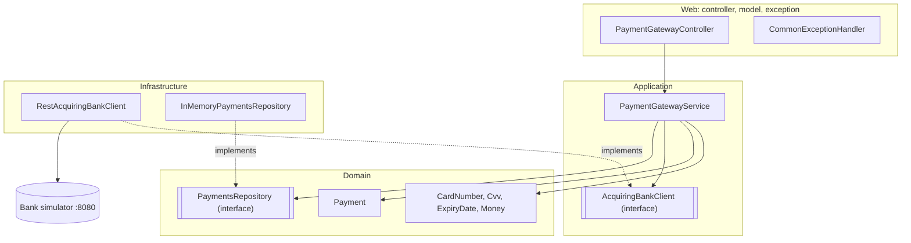

# Payment Gateway


A REST API that lets a merchant charge a card through an acquiring bank and look up payments it has already processed. Built for the Checkout.com take-home challenge with Java 17 and Spring Boot 3.1.

## Contents

1. [Running it](#running-it)
2. [Endpoints](#endpoints)
3. [Architecture](#architecture)
4. [Validation](#validation)
5. [HTTP status codes](#http-status-codes)
6. [Assumptions](#assumptions)
7. [Retries](#retries)
8. [Security](#security)
9. [Changes to the skeleton](#changes-to-the-skeleton)
10. [What I'd do next](#what-id-do-next)

## Running it

You need JDK 17 and Docker. The Gradle wrapper (8.2.1) does not run on Java 21 or newer.

```bash
docker compose up -d     # bank simulator on :8080
./gradlew bootRun        # gateway on :8090
```

The OpenAPI docs are at http://localhost:8090/swagger-ui/index.html

### Tests

```bash
./gradlew test              # unit, API and architecture tests, no Docker needed
./gradlew integrationTest   # runs against the real simulator, needs Docker
```

`./gradlew test` passes with Docker stopped. The one test that talks to the simulator is tagged `integration` and only runs in the second command. The coverage report ends up in `build/reports/jacoco/test/html/index.html`.

## Endpoints

| Method | Path | What it does |
|---|---|---|
| POST | `/payment` | Validates the card, sends it to the bank, stores the result |
| GET | `/payment/{id}` | Returns a processed payment, with the card masked to its last four digits |

```bash
curl -X POST localhost:8090/payment -H 'Content-Type: application/json' \
  -d '{"card_number":"2222405343248877","expiry_month":4,"expiry_year":2035,"currency":"GBP","amount":100,"cvv":"123"}'
```

```json
{
  "id": "3f1c6a2e-...",
  "status": "Authorized",
  "card_number_last_four": "8877",
  "expiry_month": 4,
  "expiry_year": 2035,
  "currency": "GBP",
  "amount": 100
}
```

The simulator decides by the card's last digit. Odd digits are authorized, even digits are declined, and zero returns a 503.

## Architecture

The code is split into four layers, and every dependency points inwards.



Solid arrows mean "uses" and dotted arrows mean "implements". Nothing points out of the domain, and the infrastructure classes point inwards, at interfaces the inner layers declare.

| Layer | Package | What it holds |
|---|---|---|
| Domain | `domain` | The `Payment` entity, the value objects (`CardNumber`, `Cvv`, `ExpiryDate`, `Money`), the repository interface. It imports nothing else from the project. |
| Application | `application` | `PaymentGatewayService`, the use case, plus its commands and the `AcquiringBankClient` interface. It knows the domain, but not HTTP or storage. |
| Infrastructure | `infrastructure` | The in-memory repository and the REST client for the bank. Both implement interfaces declared by the inner layers. |
| Web | `controller`, `model`, `exception`, `configuration` | The controller, request and response DTOs, the error handler and Spring configuration. |

Because the repository and bank interfaces live in the inner layers, the outer layer depends on them and not the other way round. Swapping the in-memory map for Postgres, or the simulator for a real bank, means adding one class in `infrastructure`. The domain and the use case stay as they are.

Everything is in one Gradle project instead of one module per layer. Modules would give compiler-checked boundaries, but that build setup isn't worth it for two endpoints. An ArchUnit test covers the same ground instead. The build fails if the domain imports another layer, if the application imports infrastructure or web code, or if the controller talks to the repository directly.

Each boundary has its own classes: the request DTO, the domain types and the bank's payload are all separate. If the bank renames a field, only the two bank DTOs change, and they're package-private, so nothing outside the bank client can depend on them.

## Validation

Every rule is checked twice but written once.

Bean Validation annotations on the request DTO check that fields are present and well formed. They report every problem in a single response, so a merchant who sends an empty body gets six reasons back instead of fixing them one at a time.

The value objects check the same rules in their constructors, plus two that annotations can't express: the expiry date can't be in the past, which depends on the clock, and the currency has to be one of the three supported. They run whatever the entry point is, so a caller that skips the web layer still can't create an invalid payment. When a value object rejects a payment, the bank is never called and nothing is stored.

Both layers share the same constants. The regexes and limits are `public static final` fields on the value objects, and the annotations point at them (`@Pattern(regexp = CardNumber.PATTERN)`), so the two can't drift apart.

## HTTP status codes

| Scenario | HTTP | Body | Bank called | Stored |
|---|---|---|---|---|
| Authorized | 200 | `status: Authorized` | Yes | Yes |
| Declined | 200 | `status: Declined` | Yes | Yes |
| Invalid payment (a broken rule, a missing field, or a body that can't be read) | 422 | `status: Rejected` and a list of `reasons` | No | No |
| Id is not a UUID | 400 | `message` | No | No |
| Payment not found | 404 | `message` | No | No |
| Bank returned 5xx or couldn't be reached | 502 | `message` | Yes | No |
| Bank returned 4xx | 500 | `message` | Yes | No |

Some of these are judgement calls, so here is the reasoning.

A decline returns 200. The bank answered and the API did its job; the answer just happened to be no.

Every invalid payment request returns 422 with `status: Rejected`, whether it breaks a rule (an expired card) or can't be read at all (broken JSON, `10.50` as an amount, a month written as `04`). The challenge defines Rejected as "invalid information was supplied", and all of those are exactly that. The reasons still tell them apart: a broken rule says what was wrong, and an unreadable body names the field or says the JSON is invalid, without echoing what was sent. The only 400 left is a GET with an id that isn't a UUID, because that's a lookup, not a payment.

A bank outage returns 502 rather than 500, because our side worked and the bank didn't, so trying again later is reasonable. A 4xx from the bank is different: it means we built a bad payload after the merchant's request passed all our checks. Retrying won't fix that, so it returns 500 and the log flags it as a gateway bug.

Error responses never include exception messages. The details go to the log.

## Assumptions

- The supported currencies are GBP, USD and BRL. The challenge caps it at three, and GBP matches its examples.
- Zero and negative amounts are rejected. The challenge only says the amount is an integer; a payment of zero or less makes no sense to send to a bank.
- A card is valid through the end of its expiry month, so a card expiring this month is accepted.
- The expiry year can't be earlier than the current year or later than 9999. The bank expects `MM/YYYY`, so a five-digit year couldn't be sent anyway.
- Card numbers with spaces or dashes are rejected, not cleaned up.
- Rejected payments aren't stored. No payment was created, so there's nothing to fetch.
- Declined payments are stored and can be fetched, since merchants need them for reconciliation.
- Amounts are integers in the currency's minor unit (`1050` is £10.50), up to the `Integer` limit of roughly £21 million per payment. Jackson accepts `10.50` in an integer field by default and silently truncates it to `10`, so `accept-float-as-int` is turned off and a decimal amount is rejected.
- Payment ids are random UUIDs.
- Storage is in memory and is lost on restart, which the challenge allows.
- There is no idempotency, so sending the same request twice creates two payments.
- Request bodies must be valid JSON, so a number with a leading zero (`"expiry_month": 04`) is rejected. The month can be sent as `4` or as the string `"04"`.

## Retries

The call to the bank is tried at most 3 times in total (waiting 300 ms before the second attempt and 600 ms before the third), and a retry only happens when it's guaranteed that the request never reached the bank.

| Failure | What the client sees | Retried? | Why |
|---|---|---|---|
| Connection refused | `ConnectException` | ✅ | The request never left the gateway |
| DNS failure | `UnknownHostException` | ✅ | The bank's address was never resolved |
| TLS handshake failure | `SSLException` | ✅ | No connection was ever established |
| Bank returns 503 or 500 | An HTTP response | ❌ | The bank may have processed the payment, so a second attempt could charge the card twice |
| Timeout | `SocketTimeoutException` | ❌ | With the JVM's default HTTP client, connect and read timeouts throw the same exception, so "never connected" can't be told apart from "sent it and got no answer" |
| Bank returns 4xx | An HTTP response | ❌ | Our payload is wrong, and sending it again repeats the mistake |

Being this strict means some transient failures are never retried. For payments that's the right side to err on: a failed payment can be sent again by the merchant, while a double charge turns into a refund and an incident.

`@Retryable` filters by exception type, but this decision depends on the exception's cause. So the client wraps the safe cases in its own exception type and retries only on that one. When the attempts run out, a `@Recover` method turns the failure into `BankUnavailableException`, which becomes a 502 like any other outage. The two bank exceptions are marked `notRecoverable`, so they reach the error handler untouched instead of being routed to a recovery method that doesn't match them.

Retries only happen on failures that are usually instant, so they add about 0.9 s of waiting at most. The slowest single call is bounded by the timeouts, 2 s to connect and 5 s to read, and a timeout is never followed by another attempt.

## Security

The full card number and the CVV are never stored or returned. `Payment.create` receives the full card number and keeps only its last four digits, and the CVV only exists in the request sent to the bank. The `toString()` of the card, CVV and request objects is masked, and a test checks that neither value shows up in an API response.

These are out of scope here, but a production version would need them:

- **Authentication, scoped per merchant.** Right now anyone who can reach the API can fetch any payment if they know its id.
- **Rate limiting.** Without it, a leaked key could be used to test stolen card numbers against the bank.
- **Idempotency keys.** A merchant that retries after losing a response shouldn't create a second charge. It's the same concern as the retry rule above, seen from the merchant's side.

## Changes to the skeleton

- `PostPaymentRequest` had only the last four digits of the card, so no payment could ever be authorized. It now takes the full number.
- The expiry date was formatted as `4/2030`. The simulator needs `04/2030`.
- `cardNumberLastFour` was an `int`, which turns `0123` into `123`. It's a `String` now.
- The 404 message said "Page not found". It now says "Payment not found".
- The GET now returns the `GetPaymentResponse` that shipped unused, so each endpoint has its own response type.
- The repository used a `HashMap`, which isn't safe under concurrent requests. It's a `ConcurrentHashMap` now.
- The `RestTemplate` timeouts went from 10 s to 2 s (connect) and 5 s (read), and moved to `application.properties` along with the bank URL.
- `ErrorResponse` became a record, like the other DTOs.
- `EventProcessingException` was replaced by `PaymentNotFoundException`.
- The two provided tests put the API's response object straight into the repository, which ties storage to the JSON format. They were rewritten against the domain entity.
- The GET route stayed as it was (`/payment/{id}`), and the POST uses the same prefix.

## What I'd do next

1. **Save the payment as `Pending` before calling the bank**, update it with the answer, and reconcile anything left pending. Today, if the bank authorizes and saving fails, the money moves and there's no record of it. It's the one place in this design where money can go missing. I didn't build it here: with in-memory storage, a `Pending` record would disappear with the process in the same crash it's meant to survive, and the simulator has no endpoint to ask for a payment's status, so there would be nothing to reconcile against. It becomes worth building together with durable storage.
2. **Idempotency keys**, so retries are safe from the merchant's side too.
3. **A circuit breaker**, so a long bank outage doesn't cost three attempts on every request.
4. **Metrics and tracing**: `payments_processed_total` tagged by status and currency, bank latency at p95 and p99, a count of bank outages, and a trace id on every response so a merchant's support ticket can be matched to our logs. Card numbers and CVVs stay out of logs, as the log-capture test already checks.
5. **An injected `Clock` in `ExpiryDate`**, so the expiry tests don't depend on today's date.
